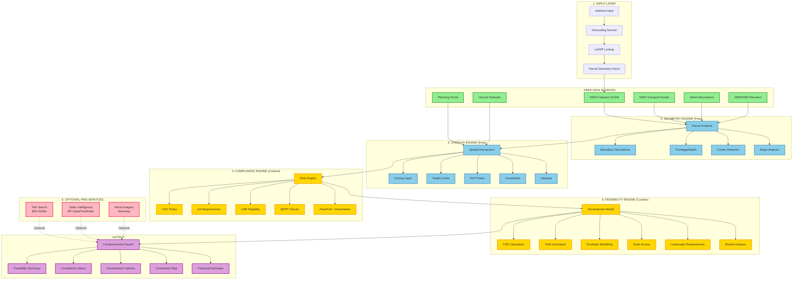

# DevGPT Architecture Flow Diagram

This document provides a visual representation of the NSW Property Intelligence data pipeline and processing flow.

---

## System Architecture Overview



---

## Processing Pipeline Detail

### Stage 1: Input Processing
1. **Address Entry** → User provides NSW address
2. **Geocoding** → Convert to coordinates (Google Maps / Nominatim)
3. **Lot/DP Lookup** → Identify legal parcel identifiers
4. **Geometry Fetch** → Retrieve parcel polygon from DCDB

### Stage 2: Geometry Engine (Free)
Using NSW Cadastre data:
- Calculate frontage, depth, side boundaries
- Detect corner lots and irregular shapes
- Compute slope from DEM data
- Measure road adjacency

### Stage 3: Overlay Engine (Free)
Spatial intersection with:
- Zoning maps (R1, R2, R3, R4, B1-B8, etc.)
- Height limit maps
- DCP layers (precinct controls)
- Environmental constraints
- Hazard zones (bushfire, flood, etc.)

### Stage 4: Compliance Engine (Custom Logic)
Rule-based assessment:
- **CDC (Complying Development)** - Check against codes
- **DA (Development Application)** - Required pathways
- **LMR (Low Rise Medium Density)** - SEPP eligibility
- **Other SEPPs** - Affordable housing, infrastructure, etc.

### Stage 5: Feasibility Engine (Custom)
Development modelling:
- Apply FSR (Floor Space Ratio)
- Calculate unit yield
- Model building envelopes
- Check solar access compliance
- Calculate deep soil & landscaping
- Optional: Market comparables

### Stage 6: Due Diligence Add-Ons (Paid - Optional)
- **Title Search**: Easements, covenants, encumbrances
- **Sales Data**: Recent comparable sales, valuation
- **Imagery**: High-res aerial photos, 3D models

---

## Data Flow Summary

```
Address Input
    ↓
[FREE] Cadastre + Boundaries + Elevation
    ↓
[COMPUTED] Geometry + Spatial Analysis
    ↓
[FREE] Planning Overlays + Constraints
    ↓
[CUSTOM] Compliance Rules + Feasibility Model
    ↓
[PAID - Optional] Title + Sales + Imagery
    ↓
Comprehensive Development Report
```

---

## Technology Stack

### Spatial Processing
- **GeoPandas** - Python spatial operations
- **PostGIS** - Spatial database queries
- **Shapely** - Geometric calculations
- **GDAL** - Raster/vector conversions

### Data Sources
- **NSW Spatial Services** - WMS/WFS endpoints
- **NSW Planning Portal** - ArcGIS REST services
- **Google Maps API** - Geocoding & places
- **OpenStreetMap** - Backup geocoding (Nominatim)

### Application Layer
- **Next.js 14+** - Frontend framework
- **FastAPI** (planned) - Backend computation engine
- **TypeScript** - Type-safe development
- **React** - UI components

---

## Cost Structure

| Component | Cost | Required For |
|-----------|------|-------------|
| NSW Cadastre | **Free** | Core geometry |
| Planning overlays | **Free** | Zoning & rules |
| Elevation data | **Free** | Slope analysis |
| Transport data | **Free** | TOD analysis |
| Hazard data | **Free** | Risk assessment |
| **Total Core** | **$0** | **Feasibility stage** |
| Title search | $20-45 | Due diligence |
| Sales data | Subscription | Market analysis |
| Aerial imagery | Subscription | Site context |

---

## Performance Considerations

### Real-time Processing
- **Geocoding**: < 1 second
- **Geometry fetch**: 1-3 seconds
- **Spatial overlays**: 2-5 seconds
- **Compliance engine**: 1-2 seconds
- **Total response**: 5-15 seconds typical

### Caching Strategy
- Cache parcel geometry (30 days)
- Cache planning overlays (7 days)
- Cache DEM tiles (90 days)
- Invalidate on planning instrument updates

### Scalability
- Async processing for batch jobs
- Queue system for high-volume requests
- CDN for static data layers
- Database indexing for spatial queries

---

## Future Enhancements

1. **Machine Learning Integration**
   - Automated precedent analysis
   - Development yield prediction
   - Market trend forecasting

2. **3D Visualisation**
   - WebGL building envelopes
   - Solar access animation
   - Neighbourhood context models

3. **Workflow Automation**
   - Auto-generate DA documentation
   - Compliance report generation
   - Cost estimation refinement

4. **Extended Coverage**
   - Interstate cadastres (VIC, QLD, etc.)
   - Additional data sources
   - Custom DCP rule libraries

---

*This flow diagram is maintained as part of the Data Architecture documentation.*
