# 🏗️ NSW Property Intelligence Engine (DevGPT)

A high-accuracy, parcel-level planning feasibility engine for NSW that uses free government spatial datasets + optional commercial add-ons.

Designed to power automated CDC/DA/LMR assessments, site selection, overlays, constraints, and development feasibility.

---

## 🔌 Overview

This engine ingests an address or Lot/DP, fetches its legal parcel polygon from NSW Cadastre, and runs a full spatial + planning analysis pipeline:

- **Geometry extraction**
- **Slope + envelope modelling**
- **Zoning + constraints**
- **Planning rules engine**
- **FSR/height/yield calculation**
- **Automated feasibility scoring**

The goal is to provide **developer-grade feasibility intelligence** for Johinke Developments and DevGPT-powered tools.

---

## 📦 Core Capabilities

### 1. Cadastre (Parcel Geometry)

**Source:** NSW Cadastre Web Service (DCDB)  
**Cost:** Free  
**Purpose:** Provides the primary parcel polygon and cadastral identifiers.

**Includes:**
- Lot & Plan (DP)
- Parcel polygon (GeoJSON/WKT)
- Parcel area
- Centroid
- LGA & locality

**Used as the anchor geometry for all downstream calculations.**

---

### 2. Survey Geometry (Derived)

Computed directly from cadastre polygon.

**Derived metrics:**
- Frontage
- Rear boundary
- Left/right boundary lengths
- Site depth
- Site width profiling
- Parcel regularity
- Corner-lot detection
- Adjacent parcel IDs
- Road adjacency

**No paid datasets required.**

---

### 3. Spatial Relationships (Derived)

Using road centrelines, admin boundaries, and the parcel geometry:

- Distance to road
- Road reserve width
- Walkable buffers (200–800m)
- Town centre rings (400m / 800m)
- Neighbour parcel relationships
- Street hierarchy classification

---

### 4. Administrative Layers

Free datasets joined to parcel:

- **LGA**
- **Locality**
- **Ward / precinct**
- **DCP areas**
- **Cadastral suburb code**
- **SEPP boundaries**
- **LEP boundaries**

---

### 5. Title Metadata (Optional, Paid)

**Source:** NSW LRS via authorised brokers  
**Cost:** $20–$45 per title (per site)

**Optional values:**
- Title reference
- Easements & covenants
- Registered dealings
- Edition number / status

**Used only for DD-stage validation.**

---

### 6. Development-Relevant Derived Data (Computed)

Using DEM/DSM + parcel geometry:

- Mean/max slope
- Slope direction
- Cut/fill heuristics
- Aspect
- Shadow envelopes
- Private open space modelling
- Deep soil / landscaping
- Building envelopes
- Height planes
- Yield estimation
- Dual occ / terrace / manor feasibility

---

### 7. Planning Constraints & Hazards

Free datasets from NSW Spatial Services + Planning Portal:

- **Flood prone land**
- **Bushfire prone land**
- **Acid sulfate soils**
- **Foreshore building lines**
- **Coastal hazard areas**
- **Heritage items & conservation areas**
- **Riparian buffers**
- **Biodiversity layers**
- **Geotechnical risk**
- **Environmental constraints**

**Applied through spatial intersection with the parcel.**

---

## 🧠 Architecture Summary

### Core Engine (Free)

- NSW Cadastre
- NSW DEM / DSM
- NSW Planning Overlays
- NSW Hazard Layers
- Transport road centrelines
- Administrative boundaries

**Handles 90% of the intelligence without licences.**

### Optional Add-Ons

- **RP Data / Pricefinder** → Sales & valuations
- **Nearmap** → High-resolution imagery & AI layers
- **NSW LRS broker** → Easements, title metadata

**These are used only when required.**

---

## 🔄 Processing Pipeline

```
1. Input: Address → Geocode → Lot/DP lookup
2. Parcel Fetch: Retrieve cadastre polygon
3. Geometry Engine: Boundary, depth, frontage, centroid
4. Slope Engine: DEM/DSM → slope/aspect analysis
5. Overlay Engine: Flood, bushfire, heritage, etc
6. Planning Engine: LEP/SEPP/CDC rules
7. Feasibility Engine: FSR/height/yield/envelope
8. Output: Structured parcel analysis JSON
```

### Processing Flow Diagram

```mermaid
graph LR
    A[Address Input] --> B[Geocode]
    B --> C[Lot/DP Lookup]
    C --> D[Cadastre Fetch]
    D --> E[Geometry Engine]
    E --> F[Slope Engine]
    F --> G[Overlay Engine]
    G --> H[Planning Engine]
    H --> I[Feasibility Engine]
    I --> J[JSON Output]

    style D fill:#90EE90
    style E fill:#87CEEB
    style F fill:#87CEEB
    style G fill:#87CEEB
    style H fill:#FFD700
    style I fill:#FFD700
    style J fill:#DDA0DD
```



---

## 🧩 Output Structure

The engine produces a structured JSON response containing:

- **Parcel identifiers** (Lot/DP, legal description)
- **Geometry** (polygon, centroid, area)
- **Survey lengths** (frontage, depth, boundaries)
- **Spatial context** (roads, adjacency, buffers)
- **Planning controls** (zoning, FSR, height limits)
- **Hazards** (flood, bushfire, heritage, environmental)
- **Derived development metrics** (slope, envelope, yield)
- **Feasibility summary** (CDC/DA/LMR eligibility, recommendations)

**Full JSON schema:** See [PARCEL_ANALYSIS_SCHEMA.json](./PARCEL_ANALYSIS_SCHEMA.json)

---

## 🎯 Purpose

This repository forms the foundation for:

- **DevGPT** (Johinke Property Intelligence Agent)
- **Automated feasibility reports**
- **Site selection logic** for future apps
- **LMR & CDC compliance automation**
- **Planning risk assessment**
- **Developer-grade DD workflows**

---

## 📖 Related Documentation

### Core Documentation
- **[DATA_ARCHITECTURE.md](./DATA_ARCHITECTURE.md)** – Detailed 7-layer architecture breakdown
- **[ARCHITECTURE_FLOW.md](./ARCHITECTURE_FLOW.md)** – Visual processing pipeline with detailed diagrams
- **[FOLDER_STRUCTURE.md](./FOLDER_STRUCTURE.md)** – Repository organization and module structure
- **[PARCEL_ANALYSIS_SCHEMA.json](./PARCEL_ANALYSIS_SCHEMA.json)** – Complete output schema definition

### Detailed Module Documentation

| Module | Description |
|--------|-------------|
| **Geometry Module** | Boundary & slope computation algorithms |
| **Constraints Module** | Planning constraint logic and spatial intersection |
| **Planning Rules Engine** | LEP/SEPP/CDC rules implementation |
| **Feasibility Module** | Development feasibility modelling and yield calculations |
| **Datasets Index** | NSW data source endpoints and API references |

### Related Files
- [README.md](./README.md) - Documentation hub and quick start
- [../README.md](../README.md) - Main project README

---

## 🚀 Quick Start

### For Developers
1. Read this overview for high-level understanding
2. Review [DATA_ARCHITECTURE.md](./DATA_ARCHITECTURE.md) for detailed data sources
3. Check [ARCHITECTURE_FLOW.md](./ARCHITECTURE_FLOW.md) for processing pipeline
4. Use [PARCEL_ANALYSIS_SCHEMA.json](./PARCEL_ANALYSIS_SCHEMA.json) for API contracts
5. Follow [FOLDER_STRUCTURE.md](./FOLDER_STRUCTURE.md) for implementation

### For Stakeholders
- This document provides the complete system overview
- [DATA_ARCHITECTURE.md](./DATA_ARCHITECTURE.md) explains cost structure and data sources
- [ARCHITECTURE_FLOW.md](./ARCHITECTURE_FLOW.md) shows processing capabilities

---

## 💡 Key Benefits

### 1. Cost-Effective
- **90% of analysis is free** using NSW Government open data
- Paid services only used for due diligence stage
- No ongoing licensing fees for core functionality

### 2. High Accuracy
- Uses official NSW cadastre as ground truth
- Real planning overlays from NSW Planning Portal
- Authoritative constraint datasets

### 3. Automated
- Address → Complete report in 5-15 seconds
- Batch processing capability
- Caching for improved performance

### 4. Comprehensive
- 7-layer analysis model
- Multiple compliance pathways (CDC/DA/LMR/SEPP)
- Complete feasibility assessment

### 5. Developer-Grade
- Suitable for professional use
- Detailed constraint mapping
- Actionable recommendations

---

## 🔧 Technical Implementation

### Data Sources (Free)
- NSW Cadastre Web Service (DCDB)
- NSW Spatial Services WMS/WFS
- NSW Planning Portal ArcGIS REST
- NSW Transport Road Network
- Digital Elevation Model (DEM/DSM)
- Environmental datasets (EPA, OEH)

### Technology Stack
- **Backend:** Python 3.11+, FastAPI, GeoPandas, PostGIS
- **Frontend:** Next.js 15, TypeScript, React
- **Spatial:** Shapely, Rasterio, GDAL
- **APIs:** Google Maps (geocoding), NSW Government services

### Performance
- **Response time:** 5-15 seconds typical
- **Caching:** 7-90 days depending on data type
- **Scalability:** Async processing, queue system ready

---

## 📊 Data Provenance

All data sources are documented and attributed:

| Data Type | Source | Cost | Update Frequency |
|-----------|--------|------|------------------|
| Cadastre | NSW DCDB | Free | Real-time |
| Planning Overlays | NSW Planning Portal | Free | As legislated |
| Constraints | NSW Spatial Services | Free | Monthly |
| Elevation | NSW DEM | Free | Annual |
| Title | NSW LRS | $20-45 | On-demand |
| Sales | RP Data | Subscription | Daily |

---

## 🛠️ Implementation Status

### ✅ Completed
- Frontend address search and reporting
- Google Maps integration
- Basic NSW data source integration
- Sample report generation

### 🚧 In Progress
- Complete cadastre integration
- Geometry computation engine
- Compliance rules engine

### 📋 Planned
- Full feasibility calculator
- Building envelope modelling
- Batch processing API
- 3D visualisation

### 🔮 Future
- Machine learning yield prediction
- Automated DA document generation
- Interstate cadastre support

---

## 📐 Example Use Cases

### Use Case 1: Site Acquisition Due Diligence
**Input:** Target property address  
**Output:** Complete feasibility report with constraints, compliance pathways, and yield estimates  
**Time:** < 15 seconds  
**Cost:** Free (core analysis only)

### Use Case 2: Portfolio Analysis
**Input:** List of 100 addresses  
**Output:** Batch feasibility reports with ranking scores  
**Time:** ~5 minutes  
**Cost:** Free (core analysis only)

### Use Case 3: Development Application Prep
**Input:** Selected site Lot/DP  
**Output:** Full planning report + title search + sales comps  
**Time:** < 30 seconds  
**Cost:** ~$50 (includes title search)

---

## 🔒 Data Privacy & Security

- No personal data stored
- Geocoding only (no address storage)
- API keys properly secured
- NSW Government data terms complied with
- Optional paid services use secure broker APIs

---

## 📞 Support & Contact

For questions about the Property Intelligence Engine:

- **Technical:** Review documentation in `/docs/`
- **Architecture:** See [DATA_ARCHITECTURE.md](./DATA_ARCHITECTURE.md)
- **Implementation:** Follow [FOLDER_STRUCTURE.md](./FOLDER_STRUCTURE.md)
- **Issues:** Open GitHub issue

---

## 📄 License & Attribution

**Proprietary:** Johinke Developments  
**Data Attribution:** NSW Government datasets used under CC BY 4.0 licence

When using NSW Government data:
- Attribute to "NSW Spatial Services" or specific agency
- Comply with [Creative Commons BY 4.0](https://creativecommons.org/licenses/by/4.0/)

---

## 🔄 Version Information

**Current Version:** 1.0.0  
**Last Updated:** November 2025  
**Status:** Active Development

---

*This document provides a high-level overview of the NSW Property Intelligence Engine. For detailed technical documentation, refer to the related modules listed above.*
